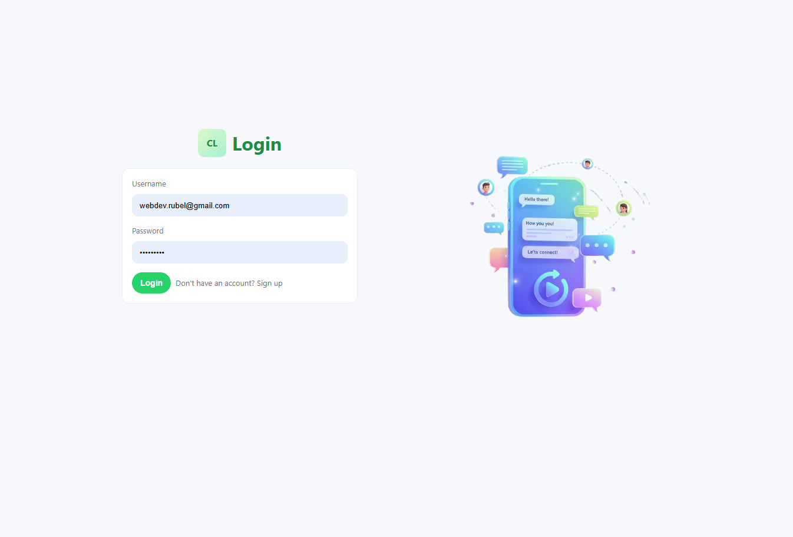
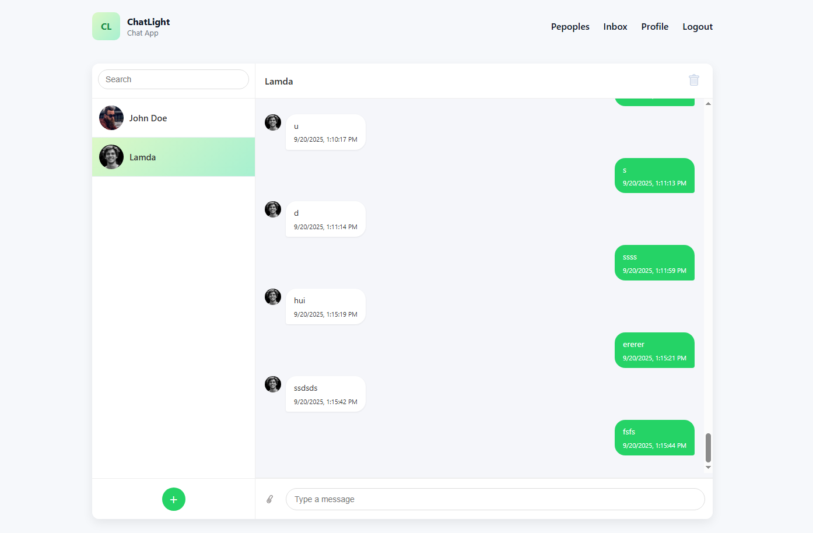
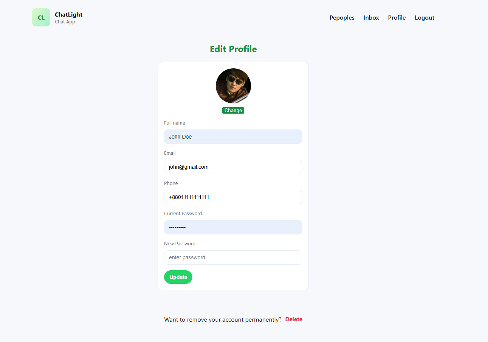
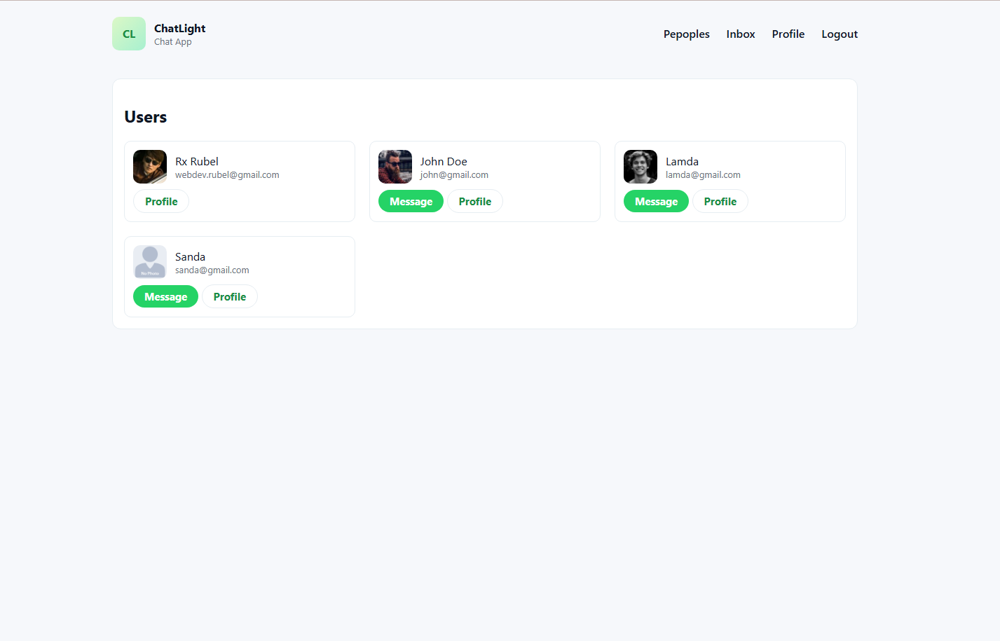

# 💬 Chat Lite

**Chat Lite** is a modern, real-time chat application designed for instant and engaging communication. Built on a **Node.js, Express, MongoDB, and Socket.IO** stack, it provides a seamless and secure platform for users to connect through private or group conversations.

## 🌟 Live Demo & Screenshots

### Home Page

### Inbox Page

### Profile Page

### Users Page

---

## 🚀 Key Features

* 🔐 **User Authentication**: Secure sign-up, login, and cookie-based session management.
* ⚡ **Real-Time Messaging**: Instant message delivery powered by **Socket.IO**.
* 👤 **Profile Management**: Users can update their profile information and avatar.
* 📥 **Flexible Inbox**: Supports both one-to-one direct messages and group chat conversations.
* 📱 **Responsive UI**: A clean, mobile-first design that works great on desktop and mobile.
* ⚠️ **Robust Error Handling**: Custom 404 and comprehensive error pages for a smooth user experience.

---

## 🛠️ Tech Stack

| Category | Technology | Description |
| :--- | :--- | :--- |
| **Backend** | **Node.js, Express, Socket.IO** | Fast, scalable server with real-time bidirectional communication. |
| **Database** | **MongoDB, Mongoose** | Flexible NoSQL database with an elegant object data modeling. |
| **Frontend** | **EJS (Embedded JavaScript)** | Simple, efficient templating engine for dynamic views. |
| **Utilities** | `dotenv`, `cookie-parser`, Express Middleware | Essential tools for environment configuration, session management, and custom logic. |

---

## ⚡ Getting Started

Follow these steps to get a copy of the project up and running on your local machine.

### 1️⃣ Prerequisites

You'll need the following software installed:

* **Node.js** (version 18 or higher)
* **MongoDB** (Local instance or a cloud service like MongoDB Atlas)
* **Git**

### 2️⃣ Installation

1.  **Clone the repository:**
    bash
    git clone [https://github.com/](https://github.com/)<your-username>/chat-lite.git
    cd chat-lite
    

2.  **Install dependencies:**
    bash
    npm install
    

### 3️⃣ Environment Setup

Create a file named **`.env`** in the root of the project and populate it with your configuration variables.

dotenv
# .env file example
APP_NAME=Chat App
MONGO_CONNECTION_STRING=mongodb://localhost:27017/chatapp  # Your MongoDB connection URI
PORT=3000

# Security Secrets - MUST BE STRONG RANDOM STRINGS
COOKIE_SECRET=48bf0c49d1282fsds651bef4bdea6d769386d26cf0a
JWT_SECRET=ererebf0c49d1282f651bef4sdsbdea6d769386d26cf0a

# JWT Configuration
JWT_EXPIRY=86400000  # Token expiry in milliseconds (e.g., 24 hours)
COOKIE_NAME=rbl-chat-app
`

| Variable | Description |
| :--- | :--- |
| `MONGO_CONNECTION_STRING` | The URI to connect to your MongoDB instance. |
| `PORT` | The server port (e.g., `3000`). |
| `COOKIE_SECRET` | Secret key for securely signing and verifying cookie values. |
| `JWT_SECRET` | Secret key used for JSON Web Token (JWT) authentication. |

### 4️⃣ Run the App

Start the server using one of the following commands:

  * **Production/Standard Run:**
    bash
    npm start
    
  * **Development (with auto-reload/hot-reloading):**
    bash
    npm run dev
    

The application will now be running at: 👉 **`http://localhost:3000`**

-----

## 🌐 Deployment

### Deploying to Render

This project is configured for easy deployment to **Render**. Simply connect your GitHub repository to your Render account; it will automatically detect and use the included `render.yaml` configuration file.

-----

## 🤝 Contributing

We welcome contributions to Chat Lite\!

1.  **Fork** the repository.
2.  Create your feature branch (`git checkout -b feature/AmazingFeature`).
3.  Commit your changes (`git commit -m 'Add some AmazingFeature'`).
4.  Push to the branch (`git push origin feature/AmazingFeature`).
5.  Open a **Pull Request**.

For major changes, please open an issue first to discuss the proposed changes.

-----

## 📜 License

This project is licensed under the **MIT License**. See the `LICENSE` file for details.